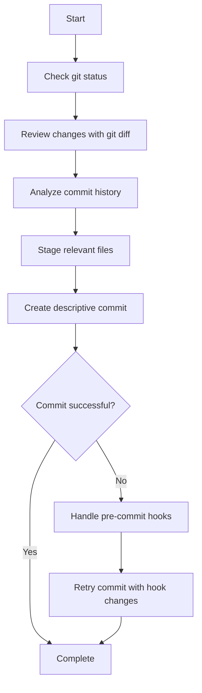
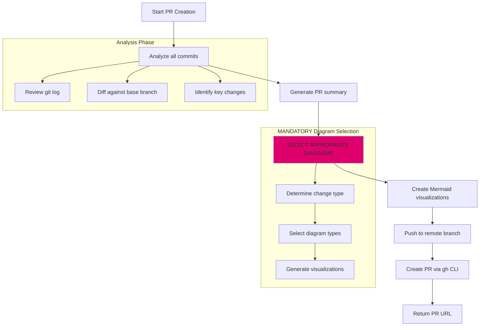

# AI Guidelines for Git Commits and Pull Requests

This document outlines the guidelines for AI (Claude) to automatically create Git commits and pull requests on GitHub, with **mandatory use of Mermaid diagrams** for visual clarity to facilitate reviewers' understanding.

## Table of Contents

1. [Git Commit Guidelines](#git-commit-guidelines)
2. [Pull Request Guidelines](#pull-request-guidelines)
3. [Mandatory Mermaid Diagram Integration](#mandatory-mermaid-diagram-integration)
4. [Diagram Selection Guide](#diagram-selection-guide)
5. [Complete Workflow](#complete-workflow)

## Git Commit Guidelines

### Commit Message Format

AI should follow this structured format for commit messages:

```
<type>(<scope>): <subject>

<body>

<footer>
```

#### Types

- **feat**: New feature
- **fix**: Bug fix
- **docs**: Documentation changes
- **style**: Code style changes (formatting, semicolons, etc.)
- **refactor**: Code refactoring
- **test**: Adding or updating tests
- **chore**: Maintenance tasks
- **perf**: Performance improvements
- **ci**: CI/CD changes

#### Example Commit Message

```
feat(auth): implement OAuth2 authentication

Added OAuth2 authentication flow with Google and GitHub providers.
Includes session management and refresh token handling.

🤖 Generated with [Claude Code](https://claude.ai/code)
```

### Commit Workflow



### Key Commit Principles

1. **Atomic Commits**: Each commit should represent a single logical change
2. **Clear Messages**: Focus on "why" not just "what"
3. **Co-authorship**: Always include AI attribution
4. **Pre-commit Hooks**: Handle automated changes gracefully

## Pull Request Guidelines

### Required PR Structure

**Important**: All pull requests must include at least one Mermaid diagram to visualize the changes. This is essential for reviewers to understand the changes.

```markdown
## Summary

- Brief description of changes (1-3 bullet points)

## Visual Overview

[MANDATORY: Include relevant Mermaid diagrams based on change type]

## Detailed Changes

[Comprehensive list of modifications]

## Test Results

[Include test outcomes with metrics]

## Impact Analysis

[Risk assessment and compatibility notes]

## Deployment Checklist

- [ ] Code review completed
- [ ] Tests passing
- [ ] Documentation updated

🤖 Generated with [Claude Code](https://claude.ai/code)
```

### PR Creation Workflow



### PR Best Practices

1. **Comprehensive Analysis**: Review ALL commits, not just the latest
2. **MANDATORY Visual Documentation**: Include at least one Mermaid diagram.
3. **Clear Test Plans**: Include specific testing instructions
4. **Link Issues**: Reference related issues when applicable
5. **Metrics**: Include quantitative test results

### Guidelines for updating PR

1. Add details as comments rather than in the body text
2. Update only the necessary parts of the body text
  - e.g.
    - In the case of implementation of an additional phase, update the description of the relevant phase in the body text.
    - In the case of testing, update the description of the relevant section in the body text.
  - Include a short summary (1 to 3 lines) of the changes
  - Link to the relevant comments

## Conclusion

This guide ensures that:
1. **Every PR includes visual documentation** through Mermaid diagrams (MANDATORY)
2. **Reviewers can quickly understand changes** through appropriate visualizations
3. **Diagram selection is systematic** based on change type
4. **Quality and clarity** are maintained across all AI-generated PRs

The use of Mermaid diagrams is not optional—it is a critical requirement for facilitating code review and maintaining high-quality documentation standards.
```
